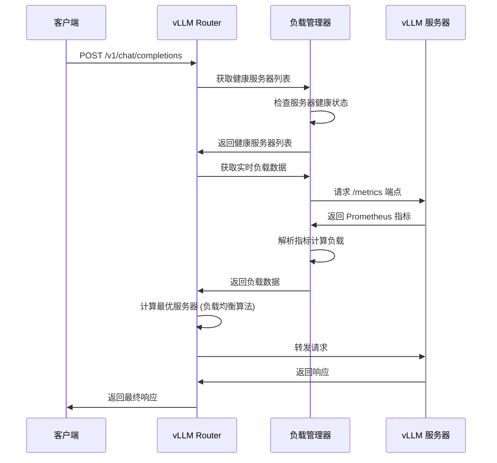
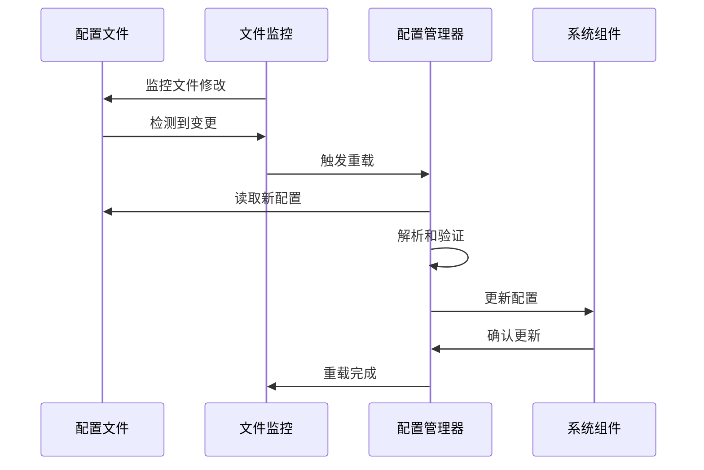
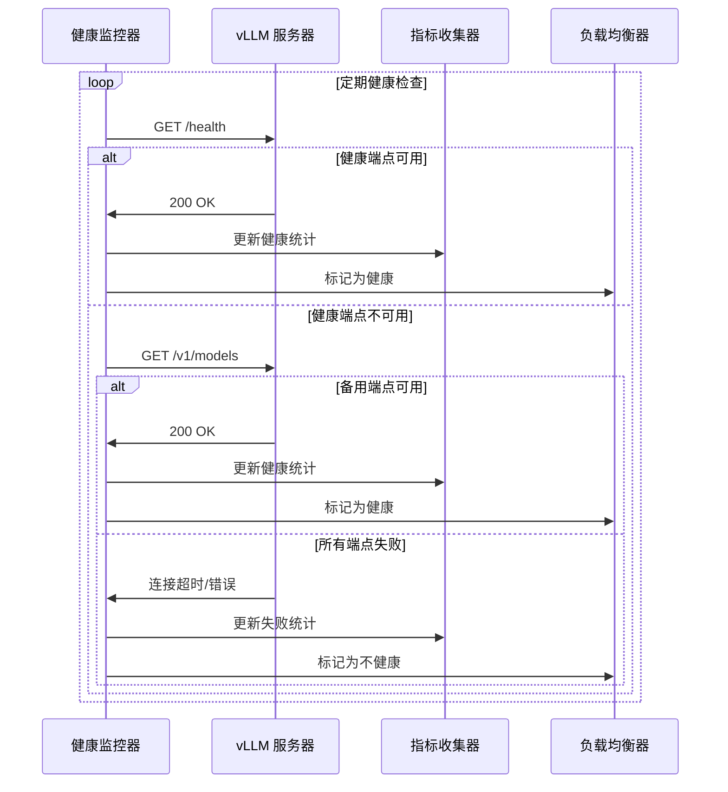

# vLLM Router 技术架构文档

## 🏗️ 系统架构概览

vLLM Router 采用模块化设计，实现了高性能、高可用的 vLLM 服务器负载均衡解决方案。

### 核心架构组件

```
┌─────────────────────────────────────────────────────────────────────────────┐
│                           vLLM Router 核心系统                             │
├─────────────────────────────────────────────────────────────────────────────┤
│                                                                             │
│  ┌─────────────────┐  ┌─────────────────┐  ┌─────────────────┐             │
│  │   配置管理器    │  │   负载管理器    │  │   健康监控器    │             │
│  │  (ConfigMgr)   │  │  (LoadMgr)     │  │  (HealthMgr)   │             │
│  │  • 热重载       │  │  • 实时监控     │  │  • 主动检查     │             │
│  │  • TOML解析    │  │  • 指标收集     │  │  • 故障转移     │             │
│  │  • 参数验证    │  │  • 可视化       │  │  • 自动恢复     │             │
│  └─────────────────┘  └─────────────────┘  └─────────────────┘             │
│           │                        │                        │             │
│           └────────────────────────┼────────────────────────┘             │
│                                    │                                      │
│  ┌─────────────────────────────────────────────────────────────────────────┤
│  │                          请求路由器 (Router)                            │
│  │  • 智能负载均衡算法  • 重试机制  • 故障转移  • 会话保持                │
│  └─────────────────────────────────────────────────────────────────────────┤
│                                    │                                      │
└────────────────────────────────────┼─────────────────────────────────────┘
                                     │
           ┌───────────────────────────┼───────────────────────────┐
           │                           │                           │
    ┌──────▼──────┐            ┌──────▼──────┐            ┌──────▼──────┐
    │  vLLM 节点 1 │            │  vLLM 节点 2 │            │  vLLM 节点 N │
    │   服务器     │            │   服务器     │            │   服务器     │
    │              │            │              │            │              │
    │ ┌──────────┐ │            │ ┌──────────┐ │            │ ┌──────────┐ │
    │ │FastAPI   │ │            │ │FastAPI   │ │            │ │FastAPI   │ │
    │ │ /metrics │ │            │ │ /metrics │ │            │ │ /metrics │ │
    │ │ /v1/*    │ │            │ │ /v1/*    │ │            │ │ /v1/*    │ │
    │ └──────────┘ │            │ └──────────┘ │            │ └──────────┘ │
    └──────┬───────┘            └──────┬───────┘            └──────┬───────┘
           │                           │                           │
    ┌──────▼──────┐            ┌──────▼──────┐            ┌──────▼──────┐
    │   GPU 核心   │            │   GPU 核心   │            │   GPU 核心   │
    │              │            │              │            │              │
    │ Llama-3.1-8B │            │ Llama-3.1-8B │            │ Mixtral-8x7B │
    │ 模型服务     │            │ 模型服务     │            │ 模型服务     │
    └─────────────┘            └─────────────┘            └─────────────┘
```

## 🔧 模块详细设计

### 1. 配置管理器 (Config Manager)

**文件**: `app/config.py`

**核心功能**:
- **TOML 配置解析**: 支持 human-readable 的配置文件格式
- **热重载机制**: 监控文件变化，无需重启即可更新配置
- **参数验证**: 使用 Pydantic 进行严格的参数验证
- **多环境支持**: 通过环境变量覆盖配置

**数据模型**:
```python
class ServerConfig(BaseModel):
    url: str                              # vLLM 服务器地址
    max_concurrent_requests: int           # 最大并发请求数
    is_healthy: bool                      # 健康状态
    health_stats: HealthCheckStats        # 健康检查统计
    consecutive_failures: int            # 连续失败次数

class AppConfig(BaseModel):
    health_check_interval: int            # 健康检查间隔
    request_timeout: int                 # 请求超时时间
    max_retries: int                     # 最大重试次数
    enable_active_health_check: bool     # 启用主动健康检查
```

**关键特性**:
- **自动恢复机制**: 定期重置长时间未失败的服务器
- **统计窗口**: 维护指定时间窗口的健康统计数据
- **故障阈值**: 可配置的连续失败阈值
- **响应时间监控**: 跟踪平均响应时间和成功率

### 2. 负载管理器 (Load Manager)

**文件**: `app/load_manager.py`

**核心功能**:
- **实时指标收集**: 从 vLLM `/metrics` 端点获取 Prometheus 指标
- **多维度解析**: 解析 `num_requests_running`、`num_requests_waiting`、`gpu_cache_usage_perc` 等
- **可视化监控**: 使用 Rich 库提供实时监控界面
- **容量计算**: 基于 GPU 资源和文件描述符限制计算实际容量

**指标解析算法**:
```python
def _parse_vllm_metrics(self, metrics_text: str) -> dict:
    metrics = {
        'num_requests_running': 0,      # 正在运行的请求数
        'num_requests_waiting': 0,      # 等待中的请求数
        'gpu_cache_usage_perc': 0.0,     # GPU 缓存使用率
        'process_max_fds': 65535,        # 最大文件描述符数
        'system_load': 0                 # 综合负载值
    }
    # 解析 Prometheus 格式指标...
    return metrics
```

**可视化特性**:
- **双模式支持**: 全屏模式和控制台模式
- **颜色编码**: 根据负载状态使用不同颜色显示
- **实时更新**: 2秒间隔的实时数据刷新
- **详细统计**: 显示服务器利用率、健康状态等详细信息

### 3. 健康监控器 (Health Monitor)

**文件**: `app/config.py` (健康监控部分)

**核心功能**:
- **主动健康检查**: 定期检查服务器 `/health` 或 `/v1/models` 端点
- **统计追踪**: 维护响应时间、成功率等统计信息
- **故障转移**: 自动标记不健康服务器并从负载均衡中移除
- **自动恢复**: 智能恢复机制，避免频繁切换状态

**健康评估算法**:
```python
# 综合评估服务器健康状态
success_rate_ok = stats.success_rate >= min_success_rate
response_time_ok = stats.avg_response_time <= max_response_time
consecutive_failures_ok = failures < max_consecutive_failures

new_health_status = success_rate_ok and response_time_ok and consecutive_failures_ok
```

**关键特性**:
- **多端点检查**: 支持多个健康检查端点
- **滑动窗口**: 基于时间窗口的统计计算
- **指数退避**: 避免频繁的健康检查干扰
- **状态持久化**: 保持服务器状态的连续性

### 4. 请求路由器 (Request Router)

**文件**: `app/routes.py`

**核心功能**:
- **智能负载均衡**: 基于容量和实时负载的智能算法
- **重试机制**: 支持自动重试和故障转移
- **API 兼容**: 完全兼容 OpenAI API 规范
- **流式响应**: 支持 SSE 流式响应

**负载均衡算法**:
```python
# 智能评分算法：(running * 3 + waiting * 1) / capacity
running = detailed_metrics.get("num_requests_running", 0)
waiting = detailed_metrics.get("num_requests_waiting", 0)
capacity = max_capacity

if capacity > 0:
    score = (running * 3 + waiting * 1) / capacity
else:
    score = float('inf')  # 避免除零错误
```

**算法优势**:
- **容量感知**: 考虑服务器的最大处理能力
- **权重分配**: 运行中请求权重更高 (3:1)
- **实时性**: 基于最新负载数据进行决策
- **故障避免**: 自动跳过不健康服务器

## 🔄 数据流处理

### 请求处理流程



### 配置热重载流程



### 健康检查流程



## 📊 性能特性

### 1. 高性能负载均衡

- **零拷贝转发**: 直接转发请求体，避免内存拷贝
- **异步处理**: 完全基于 asyncio 的异步架构
- **连接池**: 复用 HTTP 连接，减少连接开销
- **智能缓存**: 缓存配置和负载数据，减少重复计算

### 2. 可扩展性设计

- **水平扩展**: 支持无限添加 vLLM 服务器
- **垂直扩展**: 可调整单个服务器的并发容量
- **模块化**: 各组件独立，便于扩展和维护
- **插件化**: 支持自定义负载均衡算法

### 3. 高可用性

- **多级健康检查**: 主备健康检查端点
- **故障转移**: 自动检测和隔离故障节点
- **自动恢复**: 智能恢复机制，避免状态抖动
- **优雅降级**: 部分故障时继续提供服务

## 🔒 安全特性

### 1. 输入验证

- **URL 验证**: 严格的 URL 格式验证
- **参数验证**: Pydantic 模型验证
- **类型安全**: 强类型配置管理
- **边界检查**: 防止缓冲区溢出和越界访问

### 2. 访问控制

- **CORS 配置**: 可配置的跨域访问策略
- **请求限制**: 可配置的超时和重试限制
- **日志记录**: 完整的请求和错误日志
- **健康保护**: 避免健康检查被滥用

### 3. 数据保护

- **敏感信息过滤**: 日志中过滤敏感信息
- **安全传输**: 支持 HTTPS 传输
- **认证预留**: 预留认证和授权接口
- **审计日志**: 支持安全审计和合规检查

## 🚀 部署架构

### 单机部署

```
┌─────────────────────────────────────────────────────────────────┐
│                         单机 vLLM Router                        │
├─────────────────────────────────────────────────────────────────┤
│                                                                 │
│  ┌─────────────┐  ┌─────────────┐  ┌─────────────┐             │
│  │ vLLM 节点 1 │  │ vLLM 节点 2 │  │ vLLM 节点 3 │             │
│  │ localhost:8081 │  │ localhost:8082 │  │ localhost:8083 │             │
│  └─────────────┘  └─────────────┘  └─────────────┘             │
│                                                                 │
│  ┌─────────────────────────────────────────────────────────────┐ │
│  │                    vLLM Router (8888)                       │ │
│  │  • 统一入口点  • 负载均衡  • 监控面板  • 健康检查            │ │
│  └─────────────────────────────────────────────────────────────┘ │
│                                                                 │
└─────────────────────────────────────────────────────────────────┘
```

### 分布式部署

```
┌─────────────────────────────────────────────────────────────────┐
│                        分布式 vLLM Router                       │
├─────────────────────────────────────────────────────────────────┤
│                                                                 │
│  ┌─────────────────────────────────────────────────────────────┐ │
│  │                    负载均衡器 (Nginx)                        │ │
│  │                    router.domain.com                        │ │
│  └─────────────────────────────────────────────────────────────┘ │
│            │                        │                        │   │
│  ┌─────────▼─────────┐  ┌─────────▼─────────┐  ┌─────────▼─────────┐ │
│  │ vLLM Router 1     │  │ vLLM Router 2     │  │ vLLM Router 3     │ │
│  │  192.168.1.10     │  │  192.168.1.11     │  │  192.168.1.12     │ │
│  └─────────┬─────────┘  └─────────┬─────────┘  └─────────┬─────────┘ │
│            │                        │                        │   │
│            └────────────────────────┼────────────────────────┘   │
│                                     │                            │
│  ┌───────────────────────────────────┼───────────────────────────┐ │
│  │                           vLLM 服务器集群                     │ │
│  │  • 172.16.1.10-20 (GPU 服务器)                               │ │
│  │  • 混合硬件配置 (RTX 4090, A100, V100)                        │ │
│  │  • 多种模型部署 (Llama, Mixtral, etc.)                       │ │
│  └─────────────────────────────────────────────────────────────┘ │
│                                                                 │
└─────────────────────────────────────────────────────────────────┘
```

### Kubernetes 部署

```yaml
# 示例 Kubernetes 部署配置
apiVersion: apps/v1
kind: Deployment
metadata:
  name: vllm-router
spec:
  replicas: 3  # 高可用部署
  selector:
    matchLabels:
      app: vllm-router
  template:
    metadata:
      labels:
        app: vllm-router
    spec:
      containers:
      - name: vllm-router
        image: vllm-router:latest
        ports:
        - containerPort: 8888
        env:
        - name: CONFIG_PATH
          value: "/etc/servers.toml"
        volumeMounts:
        - name: config
          mountPath: "/etc/servers.toml"
          subPath: servers.toml
      volumes:
      - name: config
        configMap:
          name: vllm-router-config
```

## 📈 监控和指标

### 1. 系统指标

- **服务器健康状态**: 实时健康检查结果
- **负载分布**: 各服务器的当前负载和容量
- **响应时间**: 请求响应时间分布
- **错误率**: 请求失败率和错误类型分布

### 2. 业务指标

- **请求吞吐量**: 每秒请求数 (QPS)
- **并发连接数**: 当前活跃连接数
- **模型使用统计**: 各模型的使用频率
- **资源利用率**: GPU、内存、CPU 使用率

### 3. 监控集成

- **Prometheus**: 支持导出指标到 Prometheus
- **Grafana**: 预置的监控仪表板
- **日志聚合**: 结构化日志输出
- **告警机制**: 可配置的告警规则

这个技术架构文档提供了 vLLM Router 的完整技术设计说明，涵盖了系统架构、模块设计、数据流、性能特性、安全考虑和部署方案等各个方面。